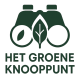

<h1 align="center">
  Semester 6 - Interdiciplinair(CMIIDP01) 

</h1>

  Het groene knooppunt: meer inzicht in de biodiversiteit van Rotterdam.

  

  

## Beschrijving
Het Groene Knooppunt is een webapplicatie die is ontwikkeld voor het vak Semester 6 Interdisciplinair, 
met als doel de volgende vraag te beantwoorden:
Hoe kunnen natuurliefhebbers inzicht krijgen in, en meer betrokken worden bij, 
het meten en verbeteren van de biodiversiteit in Rotterdam?  

De webapplicatie probeert deze vraag te beantwoorden aan de hand van drie onderdelen:
- Waarnemingen Portaal
- Dashboard
- Informatie pagina's

De webapplicatie geeft gebruikers meer inzicht en overzicht in de biodiversiteit van rotterdam door te laten zien welke soorten dieren en planten er zijn waargenomen. De getoonde soorten zijn afkomstig uit de lijst "De 10 van 010", 
dit is een selectie van dieren en planten die dienen als indicatorsoorten voor de biodiveristieti in Rotterdam. Deze soorten, zoals 
bijvoorbeeld de egel, geven een goed beeld van de algehele gezondheid van het ecosysteem.  

De waarnemingsdata is grotendeels afkomstig van Waarneming.nl. Wat Het Groene Knooppunt onderscheidt, is de specifieke focus op Rotterdam en de ‘10 van 010’. Daarnaast zijn er diverse gebruiksvriendelijke functies toegevoegd om de gebruikerservaring te verbeteren.

- Interactieve kaart van Rotterdam, waarin de buurten onderscheidbaar en klikbaar zijn gemaakt.
- Een dropdownselectiemenu voor het kiezen van een buurt.
- Mogelijkheid om een start- en einddatum te kiezen waarbinnen de waarnemingsdata van de geselecteerde buurt worden weergegeven.
- Waarnemingen worden op de kaart weergegeven wanneer je een buurt selecteert via het dropdownselectiemenu of erop klikt op de 
kaart.
- Een waarneming wordt gemarkeerd op zowel de kaart als in de lijst wanneer er via de map of lijst erop wordt geklikt.
- Gedetailleerde informatie wordt weergegeven over de geselecteerde waarneming.
- De top 3 soorten van de geselecteerde buurt in de gekozen tijdsperiode worden getoond.

## Folder structuur
`frontend`  
De frontend bestaat uit een React + TypeScript + vite webapplicatie, met de volgende ondersteunende packages:
- Leaflet: voor de interactieve kaart
- Tailwind: voor het stylen van de webapp 
- React router: voor pagina routing
- proj4: voor het projecteren van coordinaten naar wgs48 formaat

`backend`  
De backend bestaat uit een Node + Express server, met de volgende ondersteunende package:
- pg promise: voor het verbinden met de postgressql 
database
- cors: voor het omzeilen van cors errors

**Architectuur**  

De frontend en backend staan gedefinieerd in de `compose.yaml` voor Docker. Zodat beiden services individueel of samen gestart kunnen worden met `docker compose up <frontend of backend> --build` of `docker compose up --build`.

## Docker build guide
💡 Tip: Zorg dat je bekend bent met de basis van Docker voordat je aan de slag gaat.

In de `README.md` bestanden binnen de `frontend` en `backend` mappen vind je specifieke instructies voor het opzetten van beide onderdelen met Docker.

## Probleem
Deze applicatie is oorspronkelijk ontwikkeld als schoolopdracht.  
De server waarop de database en backend draaien is daarom waarschijnlijk offline.

**Oplossing:**  
Om de applicatie werkend te krijgen, zul je zelf een server moeten opzetten en daarop de database, backend en frontend hosten. Vergeet hierbij niet de juiste poorten opnieuw te configureren zodat de onderdelen met elkaar kunnen communiceren.
