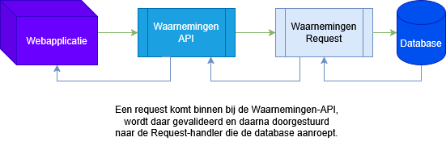

# Back end
De back-end server bestaat uit een waarnemingen API en een waarnemingen Requests.

* Waarnemingen API zorgt ervoor dat de webapplicatie via API endpoints waarnemingen data kan opvragen.
    - De volgende API Endpoints zijn aanwezig:
        - `GET` `/buurt` met parameters: start=[yyyy-mm-dd] end=[yyyy-mm-dd] buurt=[Rotterdamse buurten]  
        SUCCES -> return object {results_count: data.length, data} (data = waarnemingen data)  
        ERROR -> return status code 500 en 400 als het een validatie fout is.
        - `GET` `/buurten`  
        SUCCES -> lijst met alle buurten hun namen en geometry
        - `GET` `/buurten_names`  
        SUCCES -> Een lijst met alle buurten hun namen.
    - Daarnaast bevat het ook input validation voordat hij het doorstuurt om de request op de database te maken.

* Waarnemingen Requests zorgt ervoor dat de data werkelijk wordt opgehaald uit de database.
    - Maakt de Querys
* DB Connector regelt de databaseverbinding en bevat de inloggegevens.
 

# (Developer) hoe start je de bacakend
De webapplicatie kan op twee manieren gestart worden.

### Docker
De Dockerfile in `./backend` regelt het opzetten van een container voor development.  
Volg deze stappen om de backend via Docker te starten:

1. Installeer Docker op je systeem als dat nog niet gebeurd is.
2. Clone deze repository.
3. Open een terminal en navigeer naar de `./backend` map.
4. Voer het volgende commando uit om de Docker-container te bouwen en te starten: `docker compose up backend --build`
5. De webapplicatie is nu bereikbaar via http://localhost:8082/.  

#### Importeer packeges naar Host systeem 
Om tijdens het ontwikkelen gebruik te maken van code completion (IntelliSense),  
is het aan te raden om de `node_modules` folder van de docker container te kopieren naar de host.  
Je kunt dit als volgt doen:  

1. Check met het commando `docker ps` welke CONTRAINER ID wordt gebruikt voor "sem6_vonk3-frontend" image.
2. Zorg er voor dat je in een administrator CLI zit in de folder `sem6_vonk3\backend`  
3. #=CONTAINER ID, type vervolgens: `docker cp #:/app/node_modules .` 

De packages zijn nu op je systeem aanwezig.
### NPM (Node Package Manager) + Node.js

Je kunt de webapplicatie ook starten met npm. Volg hiervoor de onderstaande stappen:

1. **Installeer Node.js**  
  Ga naar de officiële Node.js-website en download de LTS-versie (Long Term Support).  
  De installatie van Node.js bevat automatisch npm.

2. Clone deze repository. 
3. Open een terminal en navigeer naar de `./backend` map.
4. Voer het commando `npm i`
5. Vervolgens `npm start`