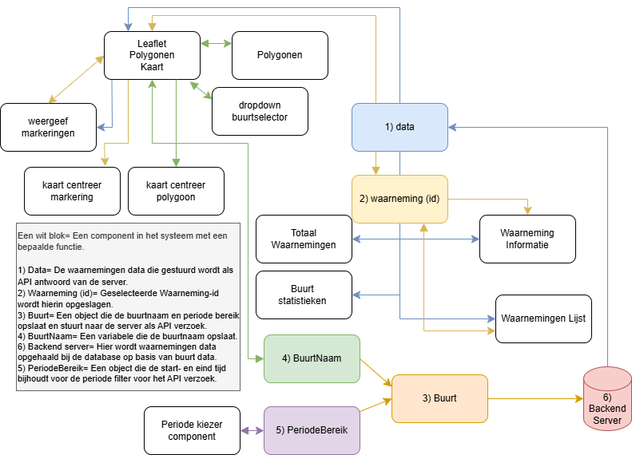

# Front end
De front-end bestaat uit pagina’s, componenten en services die samen de webapplicatie vormen.

* Componenten zijn herbruikbare UI-elementen waarmee de gebruiker direct interacteert.

* Pagina’s combineren meerdere componenten tot een volledige weergave binnen een route.

*  Services bevatten de achterliggende logica, zoals data-opvraging en statusbeheer, en houden de componenten vrij van complexe logica.

Deze structuur zorgt voor overzichtelijke, onderhoudbare en schaalbare code.  
# (Developer) hoe start je de webapplicatie
De webapplicatie kan op twee manieren gestart worden.

### Docker
De Dockerfile in `./frontend` regelt het opzetten van een container voor development.  
Volg deze stappen om de frontend via Docker te starten:

1. Installeer Docker op je systeem als dat nog niet gebeurd is.
2. Clone deze repository.
3. Open een terminal en navigeer naar de `./frontend` map.
4. Voer het volgende commando uit om de Docker-container te bouwen en te starten: `docker compose up frontend --build`
5. De webapplicatie is nu bereikbaar via http://localhost:8089/.  
(Hij staat op port 8089, door de compose.yaml, daarin wordt 5172 -> 8089 gemaped)

Zodra je wijzigingen aanbrengt in de frontend map, worden deze direct bijgewerkt in de applicatie dankzij Hot Module Replacement (HMR). zie `vite.config.ts`

#### Importeer packeges naar Host systeem 
Om tijdens het ontwikkelen gebruik te maken van code completion (IntelliSense),  
is het aan te raden om de `node_modules` folder van de docker container te kopieren naar de host.  
Je kunt dit als volgt doen:  

1. Check met het commando `docker ps` welke CONTRAINER ID wordt gebruikt voor "sem6_vonk3-frontend" image.
2. Zorg er voor dat je in een administrator CLI zit in de folder `sem6_vonk3\frontend`  
3. #=CONTAINER ID, type vervolgens: `docker cp #:/frontend_app/node_modules .` 

De packages zijn nu op je systeem aanwezig.
### NPM (Node Package Manager) + Node.js

Je kunt de webapplicatie ook starten met npm. Volg hiervoor de onderstaande stappen:

1. **Installeer Node.js**  
  Ga naar de officiële Node.js-website en download de LTS-versie (Long Term Support).  
  De installatie van Node.js bevat automatisch npm.

2. Clone deze repository. 
3. Open een terminal en navigeer naar de `./frontend` map.
4. Voer het commando `npm i`
5. Vervolgens `npm run dev`

# Systeem architectuur 
Het systeem is opgebouwd uit componenten die elk een eigen, afgebakende verantwoordelijkheid hebben.   
Deze componenten werken samen om de volledige functionaliteit van de applicatie te realiseren.   
Door deze opzet zijn de onderdelen goed van elkaar gescheiden, wat onderhoud en hergebruik verbetert.  

# Functionaliteiten van de webapplicatie
- **Waarnemingen Portaal**
  - Selecteer een buurt (kaart of dropdown) om waarnemingen te tonen.
  - Kies een datumbereik om de bijbehorende waarnemingen te filteren.
  - Klik op de blauwe cirkels (waarnemingen) voor meer informatie.
  - Klik op een waarneming uit de lijst voor meet informatie.
  - Wanneer een buurt is geselecteerd, worden de soorten en hun aantallen weergegeven.
  - Wanneer een buurt is geselecteerd, word de totaal aantal waarnemingen weergegeven.
  - Bij het selecteren van een buurt wordt de kaart gecentreerd op die buurt.
  - Wanneer je een waarneming selecteert, wordt de kaart erop gecentreerd en de waarneming gemarkeerd.
  - Waarneming in de lijst wordt gecentreerd en markeerd wanneer je een waarneming selecteert.
- **Informatie Pagina's**
  - Over ons - Startpagina met uitleg over de webapplicatie. 
  - 10 van 010 - Toont de lijst van 10 van de 010 soorten met een afbeelding en informatieve tekst.
  - Biodiversiteit tips - Algemene tips om de biodiversiteit in jouw omgeving te verbeteren.
- **Dashboard**  
  Toont per 10 van 010 soort:
  - Hoeveelheid waarnemingen over tijd.
  - Top 10 buurten waar hij wordt gespot.
  - Top 3 activiteiten
  - Buurt Heatmap
  - Gemmidelde weer omstandigheden 

# Navigatie
[Standaard template(vite+TS+react) Readme](./React%20+%20Typescript%20+%20Vite%20Readme.md)
